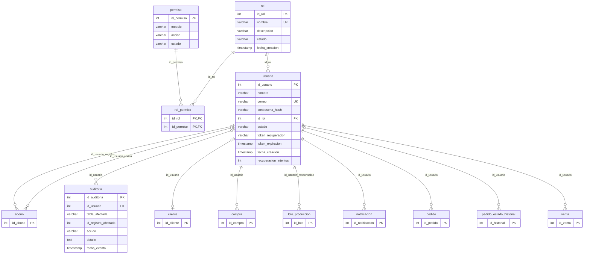
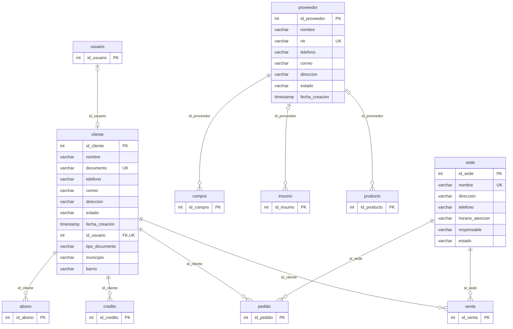
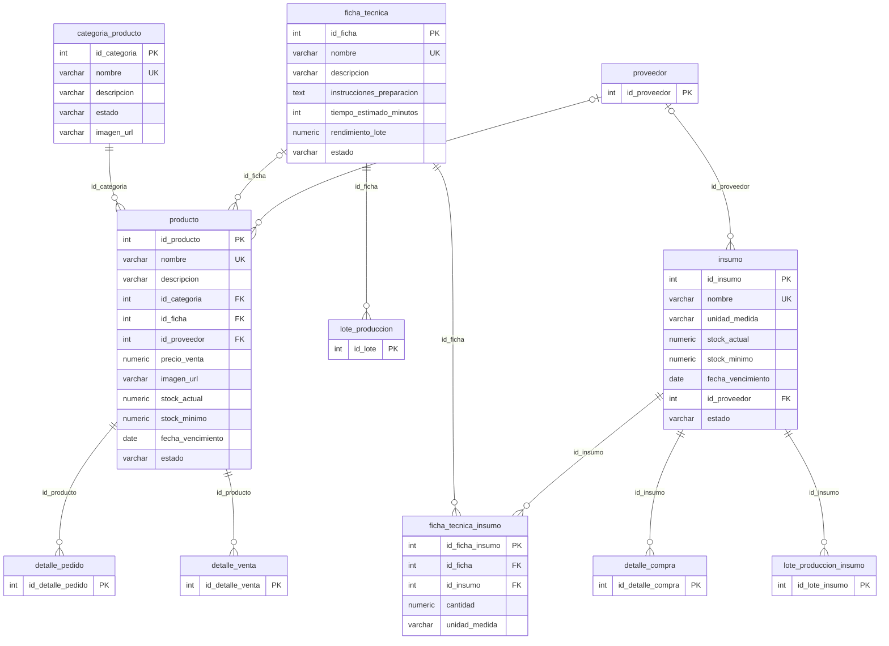
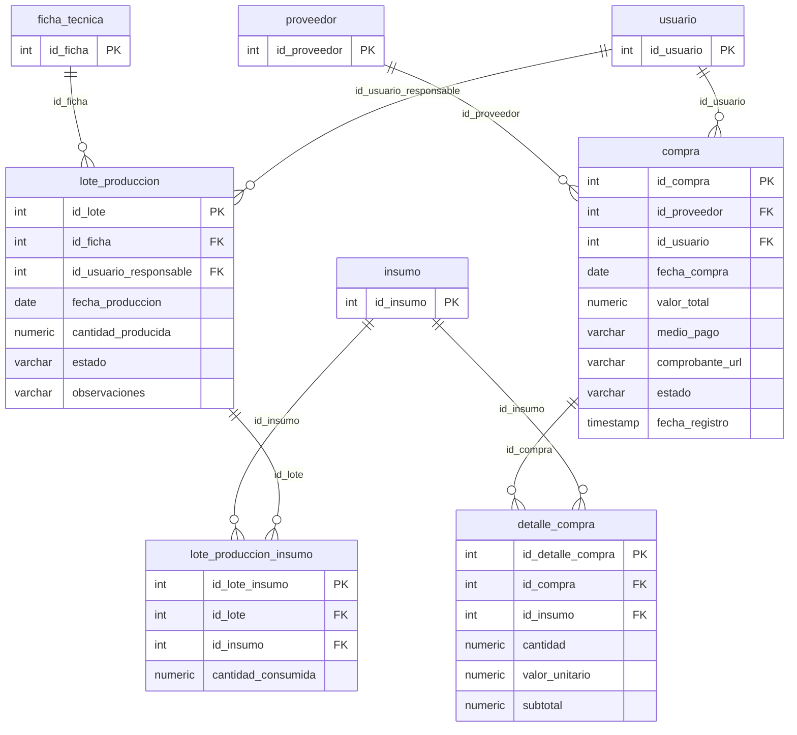
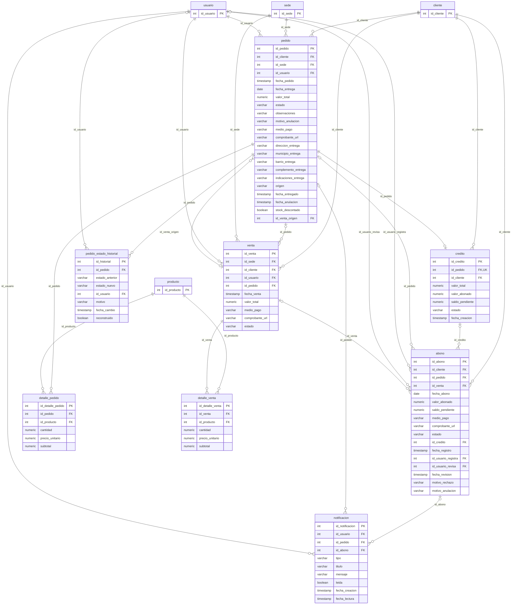

# CENAREPAS - Diagrama físico de la base de datos

**Motor:** PostgreSQL 18 · **Esquema:** `cenarepas` · **Fuente:** `Base_Datos/cenarepas_completo.sql`

## 1. Cómo se genera

- Las secciones 2 y 3 las genera `Base_Datos/herramientas/generar_documentacion.js`:
  - las tablas y columnas salen del esquema real;
  - hay una relación por cada llave foránea (`pg_constraint`);
  - los dominios salen de `Base_Datos/herramientas/descripciones.json`.
- Para regenerarlo, ver la sección 1 de `diccionario_datos.md`.
- Notación (Mermaid `erDiagram`): la tabla referenciada va a la izquierda y la que tiene la llave foránea a la derecha.

  | Notación | Significado |
  | :--- | :--- |
  | `\|\|--o{` | La llave foránea es obligatoria. |
  | `\|o--o{` | La llave foránea es opcional (admite NULL). |
  | `--o\|` | La llave foránea es además única (relación 1 a 1). |

- La etiqueta de cada relación es la columna de la llave foránea.

<!-- INICIO GENERADO por Base_Datos/herramientas/generar_documentacion.js: no editar a mano -->

## 2. Diagrama general

Las 25 tablas con sus llaves (PK, FK y UK). Las columnas completas están en los diagramas por dominio.

```mermaid
erDiagram
    abono |o--o{ notificacion : "id_abono"
    categoria_producto ||--o{ producto : "id_categoria"
    cliente ||--o{ abono : "id_cliente"
    cliente ||--o{ credito : "id_cliente"
    cliente ||--o{ pedido : "id_cliente"
    cliente ||--o{ venta : "id_cliente"
    compra ||--o{ detalle_compra : "id_compra"
    credito |o--o{ abono : "id_credito"
    ficha_tecnica ||--o{ ficha_tecnica_insumo : "id_ficha"
    ficha_tecnica ||--o{ lote_produccion : "id_ficha"
    ficha_tecnica |o--o{ producto : "id_ficha"
    insumo ||--o{ detalle_compra : "id_insumo"
    insumo ||--o{ ficha_tecnica_insumo : "id_insumo"
    insumo ||--o{ lote_produccion_insumo : "id_insumo"
    lote_produccion ||--o{ lote_produccion_insumo : "id_lote"
    pedido |o--o{ abono : "id_pedido"
    pedido ||--o| credito : "id_pedido"
    pedido ||--o{ detalle_pedido : "id_pedido"
    pedido |o--o{ notificacion : "id_pedido"
    pedido ||--o{ pedido_estado_historial : "id_pedido"
    pedido |o--o{ venta : "id_pedido"
    permiso ||--o{ rol_permiso : "id_permiso"
    producto ||--o{ detalle_pedido : "id_producto"
    producto ||--o{ detalle_venta : "id_producto"
    proveedor ||--o{ compra : "id_proveedor"
    proveedor |o--o{ insumo : "id_proveedor"
    proveedor |o--o{ producto : "id_proveedor"
    rol ||--o{ rol_permiso : "id_rol"
    rol ||--o{ usuario : "id_rol"
    sede ||--o{ pedido : "id_sede"
    sede ||--o{ venta : "id_sede"
    usuario |o--o{ abono : "id_usuario_registra"
    usuario |o--o{ abono : "id_usuario_revisa"
    usuario |o--o{ auditoria : "id_usuario"
    usuario |o--o| cliente : "id_usuario"
    usuario ||--o{ compra : "id_usuario"
    usuario ||--o{ lote_produccion : "id_usuario_responsable"
    usuario ||--o{ notificacion : "id_usuario"
    usuario ||--o{ pedido : "id_usuario"
    usuario |o--o{ pedido_estado_historial : "id_usuario"
    usuario ||--o{ venta : "id_usuario"
    venta |o--o{ abono : "id_venta"
    venta ||--o{ detalle_venta : "id_venta"
    venta |o--o{ pedido : "id_venta_origen"
    rol {
        int id_rol PK
        varchar nombre UK
    }
    permiso {
        int id_permiso PK
    }
    rol_permiso {
        int id_rol PK, FK
        int id_permiso PK, FK
    }
    usuario {
        int id_usuario PK
        varchar correo UK
        int id_rol FK
    }
    auditoria {
        int id_auditoria PK
        int id_usuario FK
    }
    sede {
        int id_sede PK
        varchar nombre UK
    }
    cliente {
        int id_cliente PK
        varchar documento UK
        int id_usuario FK, UK
    }
    proveedor {
        int id_proveedor PK
        varchar nit UK
    }
    categoria_producto {
        int id_categoria PK
        varchar nombre UK
    }
    producto {
        int id_producto PK
        varchar nombre UK
        int id_categoria FK
        int id_ficha FK
        int id_proveedor FK
    }
    ficha_tecnica {
        int id_ficha PK
        varchar nombre UK
    }
    ficha_tecnica_insumo {
        int id_ficha_insumo PK
        int id_ficha FK
        int id_insumo FK
    }
    insumo {
        int id_insumo PK
        varchar nombre UK
        int id_proveedor FK
    }
    compra {
        int id_compra PK
        int id_proveedor FK
        int id_usuario FK
    }
    detalle_compra {
        int id_detalle_compra PK
        int id_compra FK
        int id_insumo FK
    }
    lote_produccion {
        int id_lote PK
        int id_ficha FK
        int id_usuario_responsable FK
    }
    lote_produccion_insumo {
        int id_lote_insumo PK
        int id_lote FK
        int id_insumo FK
    }
    pedido {
        int id_pedido PK
        int id_cliente FK
        int id_sede FK
        int id_usuario FK
        int id_venta_origen FK
    }
    detalle_pedido {
        int id_detalle_pedido PK
        int id_pedido FK
        int id_producto FK
    }
    pedido_estado_historial {
        int id_historial PK
        int id_pedido FK
        int id_usuario FK
    }
    credito {
        int id_credito PK
        int id_pedido FK, UK
        int id_cliente FK
    }
    abono {
        int id_abono PK
        int id_cliente FK
        int id_pedido FK
        int id_venta FK
        int id_credito FK
        int id_usuario_registra FK
        int id_usuario_revisa FK
    }
    notificacion {
        int id_notificacion PK
        int id_usuario FK
        int id_pedido FK
        int id_abono FK
    }
    venta {
        int id_venta PK
        int id_sede FK
        int id_cliente FK
        int id_usuario FK
        int id_pedido FK
    }
    detalle_venta {
        int id_detalle_venta PK
        int id_venta FK
        int id_producto FK
    }
```

Relaciones: 44 (una por llave foránea).

## 3. Diagramas por dominio

Cada diagrama muestra las tablas del dominio con todas sus columnas y, solo con su llave primaria, las tablas de otros dominios con las que se relacionan.

### 3.1. Seguridad

Tablas: `rol`, `permiso`, `rol_permiso`, `usuario`, `auditoria`.
De otros dominios: `abono`, `cliente`, `compra`, `lote_produccion`, `notificacion`, `pedido`, `pedido_estado_historial`, `venta`.

| Tabla y columna | Referencia a | Cardinalidad | ON DELETE |
| :--- | :--- | :--- | :--- |
| `rol_permiso.id_permiso` | `permiso` | 0..N por cada permiso | CASCADE |
| `rol_permiso.id_rol` | `rol` | 0..N por cada rol | CASCADE |
| `usuario.id_rol` | `rol` | 0..N por cada rol | RESTRICT |
| `abono.id_usuario_registra` | `usuario` | 0..N por cada usuario (opcional) | SET NULL |
| `abono.id_usuario_revisa` | `usuario` | 0..N por cada usuario (opcional) | SET NULL |
| `auditoria.id_usuario` | `usuario` | 0..N por cada usuario (opcional) | SET NULL |
| `cliente.id_usuario` | `usuario` | 0..1 por cada usuario (opcional) | RESTRICT |
| `compra.id_usuario` | `usuario` | 0..N por cada usuario | RESTRICT |
| `lote_produccion.id_usuario_responsable` | `usuario` | 0..N por cada usuario | RESTRICT |
| `notificacion.id_usuario` | `usuario` | 0..N por cada usuario | CASCADE |
| `pedido.id_usuario` | `usuario` | 0..N por cada usuario | RESTRICT |
| `pedido_estado_historial.id_usuario` | `usuario` | 0..N por cada usuario (opcional) | NO ACTION |
| `venta.id_usuario` | `usuario` | 0..N por cada usuario | RESTRICT |

### 3.2. Sedes y terceros

Tablas: `sede`, `cliente`, `proveedor`.
De otros dominios: `abono`, `compra`, `credito`, `insumo`, `pedido`, `producto`, `usuario`, `venta`.

| Tabla y columna | Referencia a | Cardinalidad | ON DELETE |
| :--- | :--- | :--- | :--- |
| `abono.id_cliente` | `cliente` | 0..N por cada cliente | RESTRICT |
| `credito.id_cliente` | `cliente` | 0..N por cada cliente | RESTRICT |
| `pedido.id_cliente` | `cliente` | 0..N por cada cliente | RESTRICT |
| `venta.id_cliente` | `cliente` | 0..N por cada cliente | RESTRICT |
| `compra.id_proveedor` | `proveedor` | 0..N por cada proveedor | RESTRICT |
| `insumo.id_proveedor` | `proveedor` | 0..N por cada proveedor (opcional) | SET NULL |
| `producto.id_proveedor` | `proveedor` | 0..N por cada proveedor (opcional) | SET NULL |
| `pedido.id_sede` | `sede` | 0..N por cada sede | RESTRICT |
| `venta.id_sede` | `sede` | 0..N por cada sede | RESTRICT |
| `cliente.id_usuario` | `usuario` | 0..1 por cada usuario (opcional) | RESTRICT |

### 3.3. Catálogo y recetas

Tablas: `categoria_producto`, `producto`, `ficha_tecnica`, `ficha_tecnica_insumo`, `insumo`.
De otros dominios: `detalle_compra`, `detalle_pedido`, `detalle_venta`, `lote_produccion`, `lote_produccion_insumo`, `proveedor`.

| Tabla y columna | Referencia a | Cardinalidad | ON DELETE |
| :--- | :--- | :--- | :--- |
| `producto.id_categoria` | `categoria_producto` | 0..N por cada categoria_producto | RESTRICT |
| `ficha_tecnica_insumo.id_ficha` | `ficha_tecnica` | 0..N por cada ficha_tecnica | CASCADE |
| `lote_produccion.id_ficha` | `ficha_tecnica` | 0..N por cada ficha_tecnica | RESTRICT |
| `producto.id_ficha` | `ficha_tecnica` | 0..N por cada ficha_tecnica (opcional) | SET NULL |
| `detalle_compra.id_insumo` | `insumo` | 0..N por cada insumo | RESTRICT |
| `ficha_tecnica_insumo.id_insumo` | `insumo` | 0..N por cada insumo | RESTRICT |
| `lote_produccion_insumo.id_insumo` | `insumo` | 0..N por cada insumo | RESTRICT |
| `detalle_pedido.id_producto` | `producto` | 0..N por cada producto | RESTRICT |
| `detalle_venta.id_producto` | `producto` | 0..N por cada producto | RESTRICT |
| `insumo.id_proveedor` | `proveedor` | 0..N por cada proveedor (opcional) | SET NULL |
| `producto.id_proveedor` | `proveedor` | 0..N por cada proveedor (opcional) | SET NULL |

### 3.4. Producción y compras

Tablas: `compra`, `detalle_compra`, `lote_produccion`, `lote_produccion_insumo`.
De otros dominios: `ficha_tecnica`, `insumo`, `proveedor`, `usuario`.

| Tabla y columna | Referencia a | Cardinalidad | ON DELETE |
| :--- | :--- | :--- | :--- |
| `detalle_compra.id_compra` | `compra` | 0..N por cada compra | CASCADE |
| `lote_produccion.id_ficha` | `ficha_tecnica` | 0..N por cada ficha_tecnica | RESTRICT |
| `detalle_compra.id_insumo` | `insumo` | 0..N por cada insumo | RESTRICT |
| `lote_produccion_insumo.id_insumo` | `insumo` | 0..N por cada insumo | RESTRICT |
| `lote_produccion_insumo.id_lote` | `lote_produccion` | 0..N por cada lote_produccion | CASCADE |
| `compra.id_proveedor` | `proveedor` | 0..N por cada proveedor | RESTRICT |
| `compra.id_usuario` | `usuario` | 0..N por cada usuario | RESTRICT |
| `lote_produccion.id_usuario_responsable` | `usuario` | 0..N por cada usuario | RESTRICT |

### 3.5. Comercial y créditos

Tablas: `pedido`, `detalle_pedido`, `pedido_estado_historial`, `credito`, `abono`, `notificacion`, `venta`, `detalle_venta`.
De otros dominios: `cliente`, `producto`, `sede`, `usuario`.

| Tabla y columna | Referencia a | Cardinalidad | ON DELETE |
| :--- | :--- | :--- | :--- |
| `notificacion.id_abono` | `abono` | 0..N por cada abono (opcional) | SET NULL |
| `abono.id_cliente` | `cliente` | 0..N por cada cliente | RESTRICT |
| `credito.id_cliente` | `cliente` | 0..N por cada cliente | RESTRICT |
| `pedido.id_cliente` | `cliente` | 0..N por cada cliente | RESTRICT |
| `venta.id_cliente` | `cliente` | 0..N por cada cliente | RESTRICT |
| `abono.id_credito` | `credito` | 0..N por cada credito (opcional) | RESTRICT |
| `abono.id_pedido` | `pedido` | 0..N por cada pedido (opcional) | CASCADE |
| `credito.id_pedido` | `pedido` | 0..1 por cada pedido | RESTRICT |
| `detalle_pedido.id_pedido` | `pedido` | 0..N por cada pedido | CASCADE |
| `notificacion.id_pedido` | `pedido` | 0..N por cada pedido (opcional) | SET NULL |
| `pedido_estado_historial.id_pedido` | `pedido` | 0..N por cada pedido | NO ACTION |
| `venta.id_pedido` | `pedido` | 0..N por cada pedido (opcional) | SET NULL |
| `detalle_pedido.id_producto` | `producto` | 0..N por cada producto | RESTRICT |
| `detalle_venta.id_producto` | `producto` | 0..N por cada producto | RESTRICT |
| `pedido.id_sede` | `sede` | 0..N por cada sede | RESTRICT |
| `venta.id_sede` | `sede` | 0..N por cada sede | RESTRICT |
| `abono.id_usuario_registra` | `usuario` | 0..N por cada usuario (opcional) | SET NULL |
| `abono.id_usuario_revisa` | `usuario` | 0..N por cada usuario (opcional) | SET NULL |
| `notificacion.id_usuario` | `usuario` | 0..N por cada usuario | CASCADE |
| `pedido.id_usuario` | `usuario` | 0..N por cada usuario | RESTRICT |
| `pedido_estado_historial.id_usuario` | `usuario` | 0..N por cada usuario (opcional) | NO ACTION |
| `venta.id_usuario` | `usuario` | 0..N por cada usuario | RESTRICT |
| `abono.id_venta` | `venta` | 0..N por cada venta (opcional) | CASCADE |
| `detalle_venta.id_venta` | `venta` | 0..N por cada venta | CASCADE |
| `pedido.id_venta_origen` | `venta` | 0..N por cada venta (opcional) | SET NULL |

<!-- FIN GENERADO -->
